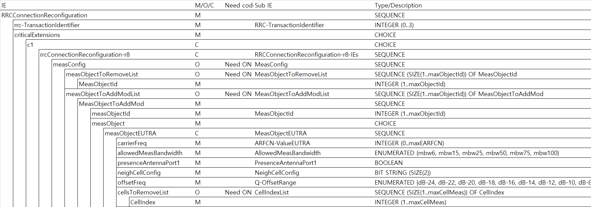

# 3GPP Message Formatter for RAN2

It generates an Excel sheet for each 3GPP RRC (36.331, 38.331) message/IE



**Looking for [RAN2/RAN3 integrated binary][3gpp-message-formatter]?**

[3gpp-message-formatter]: https://github.com/gsongsong/3gpp-message-formatter

## Installation

```sh
npm i third-gen-message-formatter-ran2
```

### Dependencies

If above does not install dependencies:

```sh
npm i cellref readline-sync third-gen-asn1-extractor third-gen-asn1-parser @gsongsong/xlsx
```

## Usage

### Command Line

```sh
node formatter <spec_file> <message/IE name>
# node formatter resources/38331-f10.txt RRCReconfiguration
```

### Package

TBA
